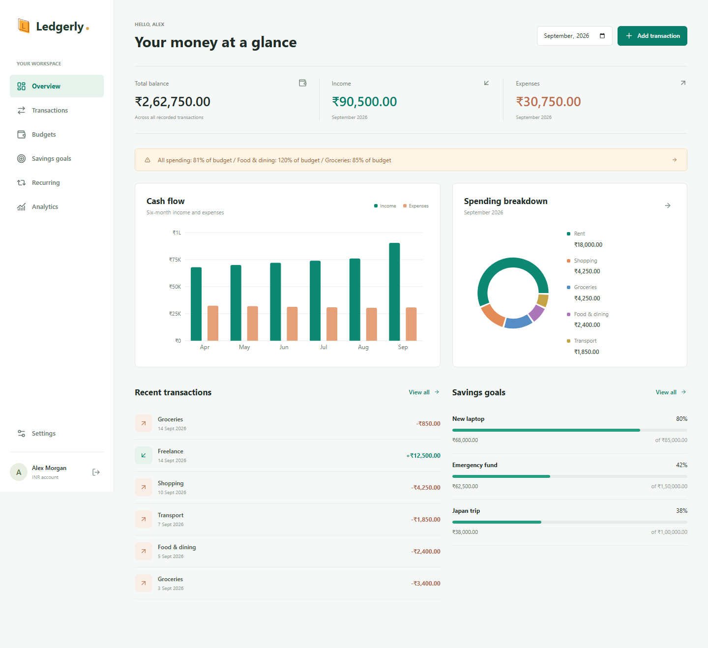
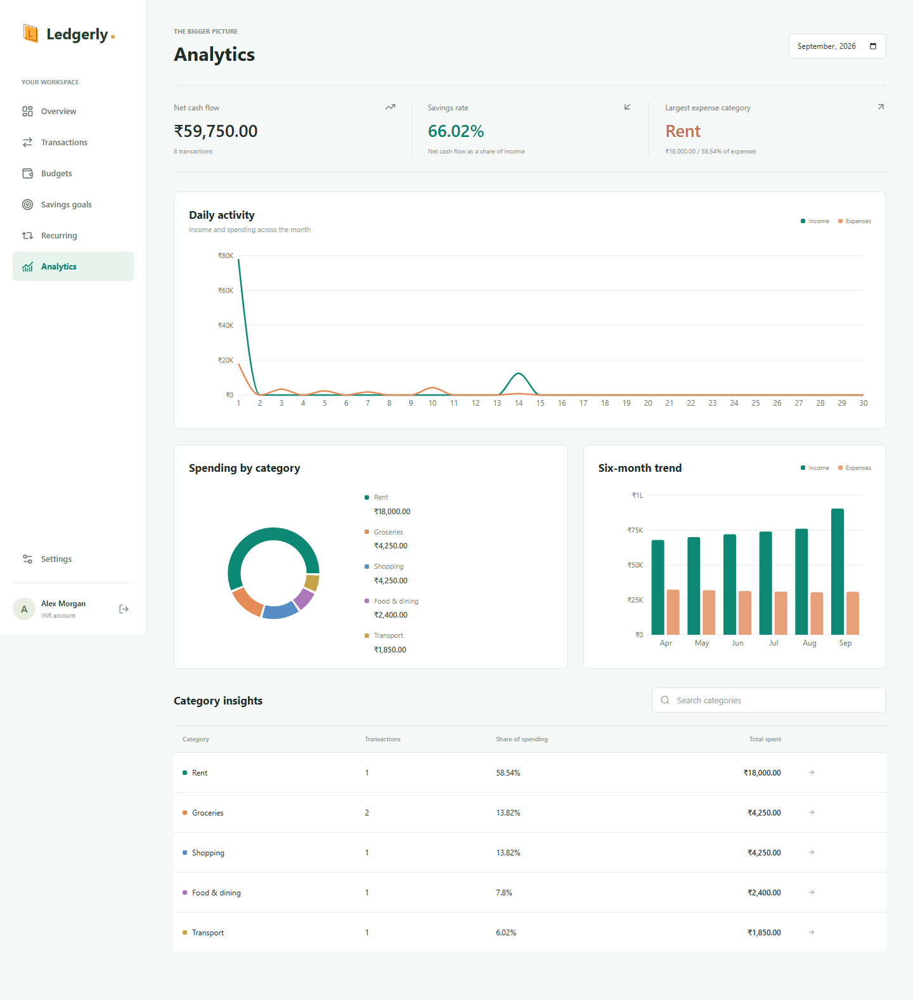
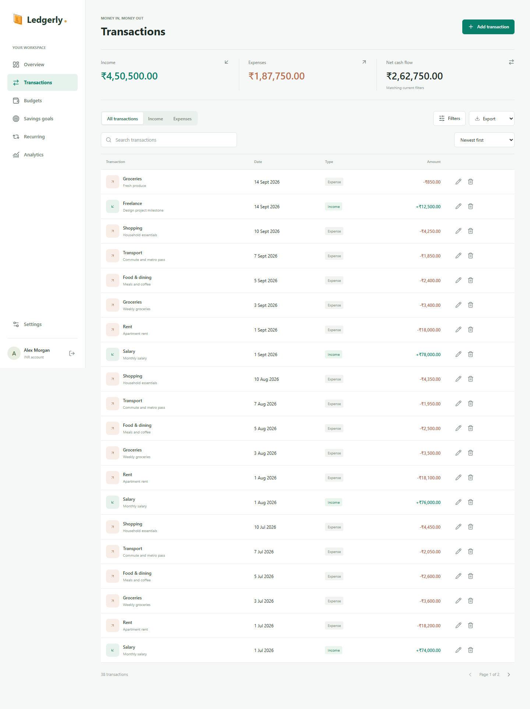
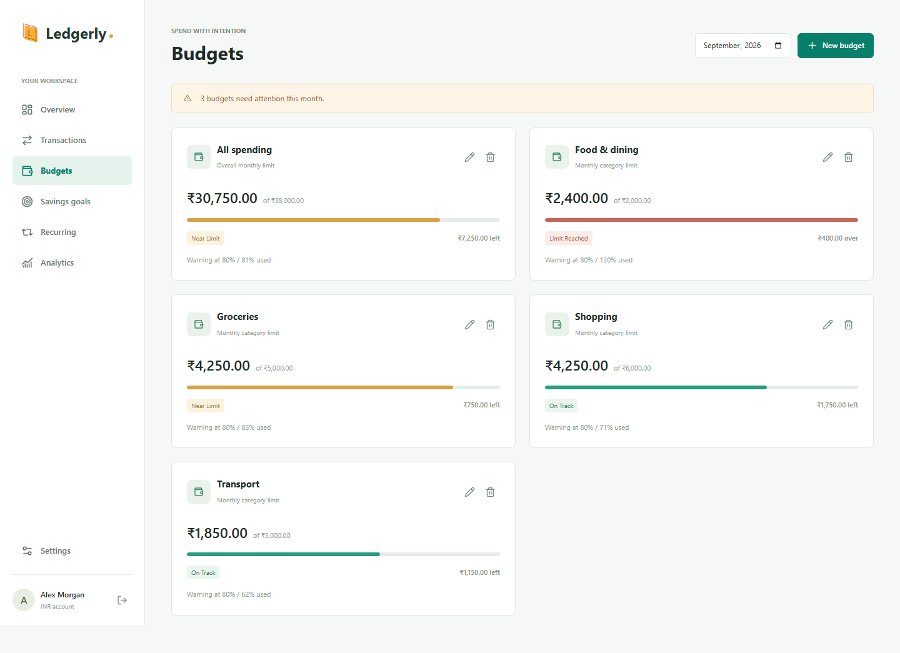
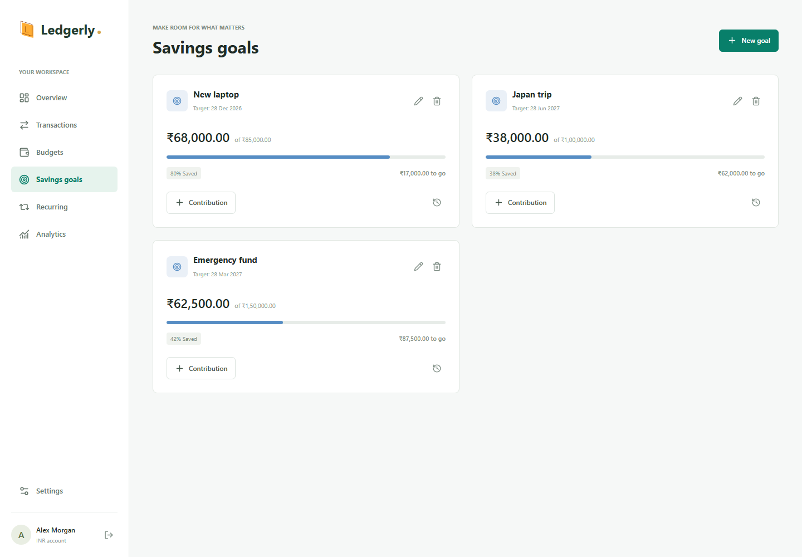
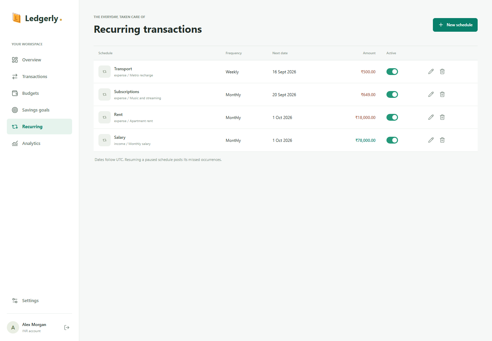
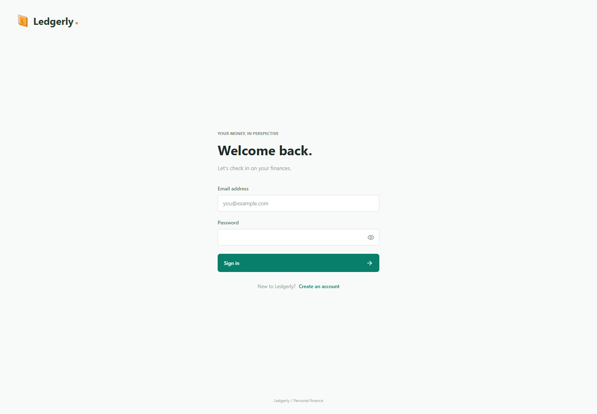
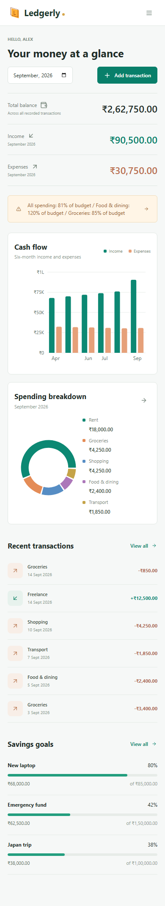

# Ledgerly

A full-stack personal finance workspace for tracking income and expenses, managing budgets, planning savings, and understanding spending patterns. Built with the MERN stack, Tailwind CSS, and Recharts.

[Live application](https://ledgerly-five.vercel.app) | [Deployment guide](DEPLOYMENT.md) | [Screenshots](#screenshots) | [Local setup](#local-setup)



## Features

| Area | What is included |
| --- | --- |
| Authentication | Email/password registration and login, JWT sessions in HTTP-only cookies, protected routes, server-side session validation, eight-hour expiry, and logout revocation. |
| Google sign-in | Google Identity Services with server-verified ID tokens and explicit account linking from Settings. Available after configuring a Google OAuth web client ID. |
| Transactions | Create, edit, and delete income and expenses; add notes; search categories, sources, and notes; filter by type, category, date range, and amount; sort and paginate results. |
| Budgets | Monthly overall and category budgets, adjustable warning thresholds, progress bars, remaining amounts, near-limit alerts, and overspending warnings. |
| Recurring transactions | Daily, weekly, monthly, and yearly schedules; optional end dates; pause/resume; future amount and label edits; catch-up posting with duplicate prevention. |
| Savings goals | Targets, optional deadlines, progress tracking, deposits and withdrawals, and the latest 100 contributions per goal. |
| Dashboard | Recorded balance, monthly income and expenses, recent activity, budget alerts, savings progress, six-month cash flow, and spending breakdowns. |
| Analytics | Daily activity, income-versus-expense trends, net cash flow, savings rate, category insights, category search, and transaction drill-down with Recharts visualizations. |
| Export | Download the full filtered transaction result as CSV or Excel, up to 10,000 rows, with spreadsheet formula-injection protection. |
| Account settings | Editable profile, private PNG/JPEG profile photos stored in MongoDB, Google account linking, and a per-account currency setting with INR as the default. |
| Responsive interface | Desktop sidebar, mobile navigation, responsive tables and charts, keyboard-accessible dialogs, loading/empty states, and retryable errors. |

### Security Measures

- Passwords are hashed with bcrypt; password hashes and internal session fields are excluded from API responses.
- JWTs are kept in HTTP-only cookies, not localStorage. Cookies use `Secure` in production and `SameSite=Lax`.
- Every financial operation is scoped to the authenticated account, including editing, deleting, analytics, and exports.
- Mutating requests require a custom request header and an approved origin; the server also uses security headers and rate limits.
- The API validates amounts, dates, identifiers, input types, and uploaded image signatures.
- Google credentials are verified server-side. An existing password account is never silently linked by email alone.

## Screenshots

These are captures of the implemented application running locally with **synthetic demonstration data**, not real financial records. Google sign-in is not enabled in these captures. The hosted application depends on the latest successful Vercel and Render deployments.

### Analytics



<details>
<summary>Transactions, budgets, savings goals, and recurring schedules</summary>

### Transactions



### Budgets



### Savings Goals



### Recurring Transactions



</details>

<details>
<summary>Authentication and mobile dashboard</summary>

### Sign In



### Mobile Dashboard



</details>

## Tech Stack

| Layer | Technologies |
| --- | --- |
| Frontend | React 19, Vite 7, React Router 7, Tailwind CSS 4, Axios, React Icons |
| Visualization | Recharts 3 |
| Backend | Node.js, Express 5, Mongoose 8, MongoDB |
| Authentication and security | JSON Web Tokens, bcrypt, Google Auth Library, Helmet, Express Rate Limit |
| Exports and dates | ExcelJS, Day.js |
| Testing | Node.js test runner, Supertest, MongoDB Memory Server, Playwright, ESLint |
| Hosting | Vercel frontend and Render backend |

## Repository Structure

```text
Ledgerly/
  backend/
    config/          Database connection
    controllers/     Auth and finance request handlers
    middleware/      Auth, request security, uploads, recurring catch-up
    models/          User, Income, Expense, Budget, Goal, Recurring
    routes/          API routes
    scripts/         Isolated development server and recurring job
    services/        Transaction queries, budgets, recurring posting
    test/            Isolated integration tests
    utils/           Input validation
    app.js           Express application
    server.js        Production entry point
    .env.example     Backend configuration template
  frontend/
    public/          Public application assets
    src/             Pages, components, hooks, context, utilities, styles
    tests/           Playwright browser tests
    .env.example     Development proxy configuration template
    vercel.json      API proxy, SPA routing, and response headers
  docs/screenshots/  Current application screenshots
  DEPLOYMENT.md      Vercel, Render, Google, and release instructions
```

## Local Setup

### Prerequisites

- Node.js 22.16 or newer and npm.
- Git.
- MongoDB for persistent development, or the disposable database option below.

```bash
git clone https://github.com/Akshat180425/Ledgerly.git
cd Ledgerly
```

### Backend

In a terminal opened in `backend`, install dependencies and start an isolated preview:

```bash
npm ci
npm run dev:local
```

The API starts on `http://127.0.0.1:8000`. This mode does not read existing database credentials. It generates a temporary JWT secret and database; **its data disappears when the process stops**. The first run downloads a MongoDB binary. `MONGOMS_SYSTEM_BINARY` can point to an existing compatible `mongod` executable.

For persistent development, create `backend/.env` from [backend/.env.example](backend/.env.example), set a separate development `MONGO_URI` and a random `JWT_SECRET` of at least 32 characters, then run `npm run dev` instead. Never use the production database for tests.

### Frontend

In a second terminal opened in `frontend`:

```bash
npm ci
npm run dev
```

Vite defaults to proxying API requests to `http://localhost:8000`. To change that target, create `frontend/.env.local` from [frontend/.env.example](frontend/.env.example). Open the URL printed by Vite and register a local account.

All browser API requests use relative `/api/v1/...` URLs. Vite proxies them during development, and Vercel proxies them in production. Keep this same-origin arrangement for cookie authentication.

### Google Sign-In

Google sign-in is optional until a client ID is configured. Create a Google OAuth **Web application** client, authorize your frontend origins, and set `GOOGLE_CLIENT_ID` in the backend environment. No client secret is required for ID-token verification. The frontend fetches the public ID from the backend. See [Google setup](DEPLOYMENT.md#google-sign-in) for the full procedure.

## Verification

Run these commands in `backend`:

```bash
npm test
npm audit
```

Backend integration tests use an isolated MongoDB instance and never connect to `MONGO_URI`. They cover authentication, account isolation, validation, exports, budgets, savings contributions, recurring schedules, analytics, and uploads. Google verification is mocked; live Google sign-in requires a configured client and a real Google account.

Run these commands in `frontend`:

```bash
npm run lint
npm run build
npx playwright install chromium
npm run test:e2e
npm audit
```

Start the isolated backend and frontend before running browser tests. The browser suite covers protected routes, the finance workflow, responsive layouts/charts, navigation, non-blocking notifications, expired sessions, and retry states. `E2E_BASE_URL` can change the local URL. **Do not point browser tests at the deployed service:** they register disposable accounts and create test transactions.

## Deployment

- **Vercel:** root `frontend`, build `npm run build`, output `dist`.
- **Render:** root `backend`, build `npm ci --omit=dev`, start `npm start`, health check `/api/v1/health`.
- Keep secrets in hosting environment settings, never in Git. Only example environment files belong in this repository.
- Coordinate frontend and backend releases because authentication now uses same-origin HTTP-only cookies. Existing users must sign in again.
- For scheduled posting while the Render web service is asleep, optionally configure a Render Cron Job with `npm run recurring` and the same backend environment.

See [DEPLOYMENT.md](DEPLOYMENT.md) for required environment variables, routing, Google configuration, recurring jobs, and release notes.

## Behavior Notes

- Savings contributions earmark funds; they do not transfer money or change the income-minus-expense balance.
- Changing currency relabels amounts and does not perform foreign-exchange conversion.
- Overall and category budgets are independent; they are not added together.
- Recurring dates use UTC. Resuming a paused schedule catches up missed occurrences. Deleting a schedule keeps its posted transactions.
- Sessions expire after eight hours. Signing out revokes every session for the account.
- Old Income, Expense, and User collections remain in use; budgets, goals, and recurring schedules use additional collections.

## Contact

- Email: [akshatbawa130806@gmail.com](mailto:akshatbawa130806@gmail.com)
- LinkedIn: [Akshat](https://linkedin.com/in/akshat180425)
